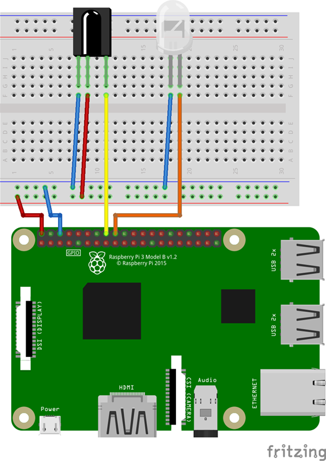

# RGB-LED IR-Steuerung
RGB-LED-Stripes per Raspberry Pi mit LIRC und Python steuern.

## Hardware Vorbereitung
An GPIO24 wird eine IR-LED angeschlossen. Andere Ports sollten auch funktionieren, jedoch muss die Config später angepasst werden. \
Optimal: Mit einem Transistor lässt sich die Reichweite erhöhen. \
Optimal: Zusätzlich kann ein IR-Receiver (an GPIO23) angeschlossen werden, um neue IR-Signale anzulernen.

#### Schaltplan


## Software Vorbereitung
- Paketquellen aktualisieren: `sudo apt update`

#### LIRC installieren
Folgende Anleitungen können hilfreich sein:
- [https://indibit.de/raspberry-pi-mit-lirc-infrarot-befehle-senden-irsend/](https://indibit.de/raspberry-pi-mit-lirc-infrarot-befehle-senden-irsend/)
- [https://gist.github.com/billpatrianakos/cb72e984d4730043fe79cbe5fc8f7941](https://gist.github.com/billpatrianakos/cb72e984d4730043fe79cbe5fc8f7941)

Diese Schritte sind nötig:
- LIRC installieren: `sudo apt install lirc`

- Boot-Config anpassen: `sudo nano /boot/config.txt`

  Die beiden Zeilen werden einkommentiert:
  ```
  dtoverlay=gpio-ir,gpio_pin=23
  dtoverlay=gpio-ir-tx,gpio_pin=24
  ```
  Gegenfalls hier die Ports anpassen.

- LIRC-Config anpassen: `sudo nano /etc/lirc/lirc_options.conf`

  ```
  driver          = default
  device          = /dev/lirc0
  ```
  */dev/lirc0* ist der Sender. \
  */dev/lirc1* ist der Empfänger.

- `sudo mv /etc/lirc/lircd.conf.d/devinput.lircd.conf /etc/lirc/lircd.conf.d/devinput.lircd.conf.dist`

- LIRC-FB-Config kopieren: Die Datei [rgbled.lircd.conf](rgbled.lircd.conf) wird in den Ordner _/etc/lirc/lircd.conf.d/_ kopiert. Gefunden habe ich die Datei [hier](https://raw.githubusercontent.com/bitboxx/raspberry-pi-lirc-rgbled-remote-emulator/master/etc/lirc/nec-rgb-led.conf).

- Raspberry Pi neustarten: `sudo reboot`

#### Optimal: IR-Empfänger testen (wenn angeschlossen)
- LIRC-Service stoppen: `sudo systemctl stop lircd`
- `mode2 -d /dev/lirc1`
- Wenn nun Buttons auf einer IR-Fernbedienung in der Nähe gedrückt werden sollte eine Ausgabe erscheinen.
- Das Anlernen neuer Fernbedienungen mit `irrecord` ist in den beiden verlinkten Anleitungen beschrieben.
- LIRC-Service wieder starten: `sudo systemctl start lircd`

#### IR-Sender testen
- LIRC-Service starten: `sudo systemctl start lircd`
- Gespeicherte Buttons ausgeben: `irsend LIST rgbled ""`
- Einzelne Codes senden: `irsend SEND_ONCE rgbled <Button-Name>` also z.B. `irsend SEND_ONCE rgbled ON`
- Sollte das nicht funktionieren ist die Fernbedienungsconfig nicht geeignet, sodass die Fernbedienung manuell angelernt werden muss.

## Python3 CLI
`python3 rgb-led-ir-control.py`

Das [Python-Programm](rgb-led-ir-control.py) ist nahezu selbsterklärend. Zunächst werden alle bekannten IR-Codes nummeriert ausgegeben. Anschließend kann der Benutzer fortlaufend die Nummer des Codes eingeben, der gesendet werden soll. Wird eine "0" eingeben, beendet sich das Programm.

Intern führt das Programm den _irsend_-Befehl aus. \
Somit kann es beliebig für weitere Fernbedienungen erweitert werden.
